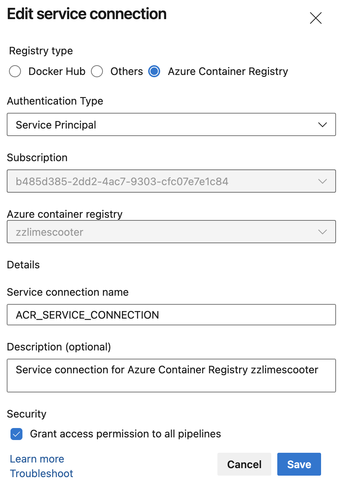
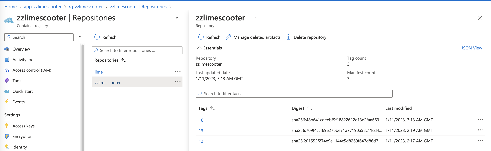

# Build and push docker images to Azure Container Registry using Azure DevOps pipelines

In this blog, I’ll show you how to create azure container registry and build and push images from Azure DevOps pipelines.

## Azure Container Registry

First we create an azure container registry using terraform

```terraform
resource "azurerm_container_registry" "acr" {
  name                = "zzlimescooter"
  resource_group_name = azurerm_resource_group.rg.name
  location            = var.location
  sku                 = "Standard"
  admin_enabled       = true
}
```


It will show up in the resource group like this


Once it’s done we can start pushing images to this container registry. We need to create a service connection in Azure DevOps to allow the pipeline to talk to the container registry.

## Azure Service Connection

Go to Azure DevOps → Project Settings → Service Connections → Docker service connection. Select the correct subscription and the container registry that just got created, in this case it will look like this.



Make sure to click on `Grant access permission to all pipelines`

## Azure DevOps pipeline

Create a yaml file called `azure-pipelines.yml` in the root directory and pasted in the following code:

```yaml
trigger:
  branches:
    include:
      - test/*
      - feat/*
      - main

variables:
  - name: repository
    value: 'zzlimescooter'
  - name: dockerfile
    value: '$(Build.SourcesDirectory)/Dockerfile'
  - name: containerRegistry
    value: 'ACR_SERVICE_CONNECTION'


stages :
  - stage: Build
    displayName: Build and push stage
    jobs: 
    - job: Build
      displayName: Build job
      steps:
      - task: Docker@2
        displayName: Build and push an image to container registry
        inputs:
          command: buildAndPush
          repository: ${{ variables.repository }}
          dockerfile: ${{ variables.dockerfile }}
          containerRegistry: ${{ variables.containerRegistry }}
          tags: $(Build.BuildId)
```

`branches`: will trigger build when the selected branches updated

`variables`

- `repository`: the repository name of the ACR

- `dockerfile`: the Dockerfile location

- `containerRegistry`: the service connection name we just created in the above step

Name the branch `test/*` or `feat/*` will trigger run everytime the branch updates. It’s worth noting that the pipeline is not tiggered via open pull request against main, test/* and feat/*. It runs against the branch updates directly. Result of the pipeline will be:




