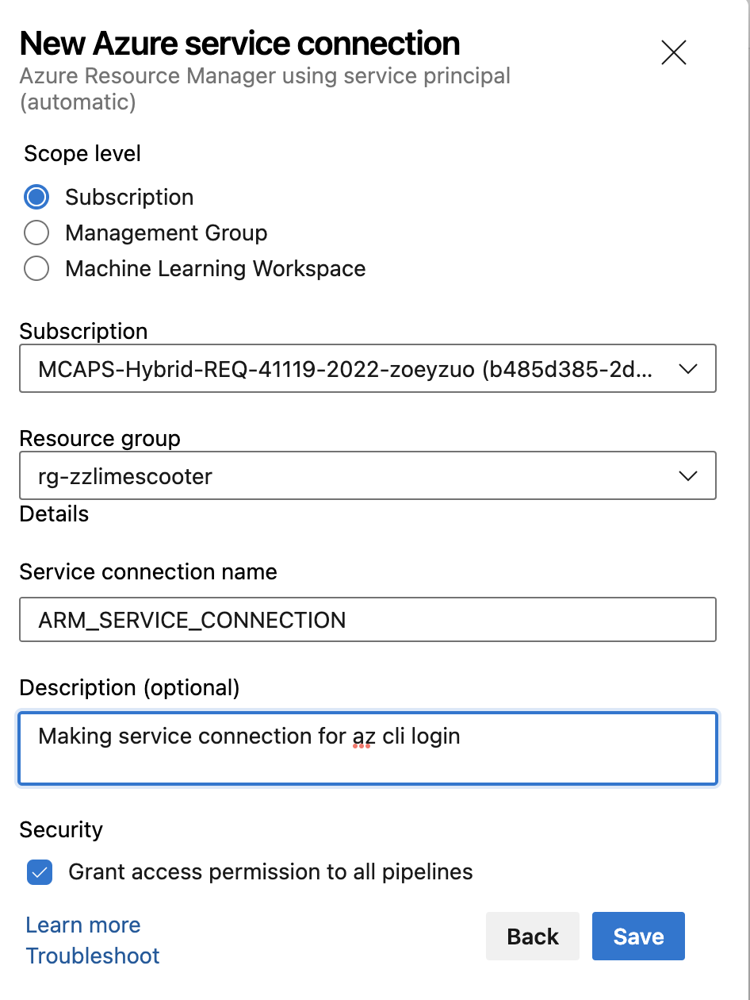
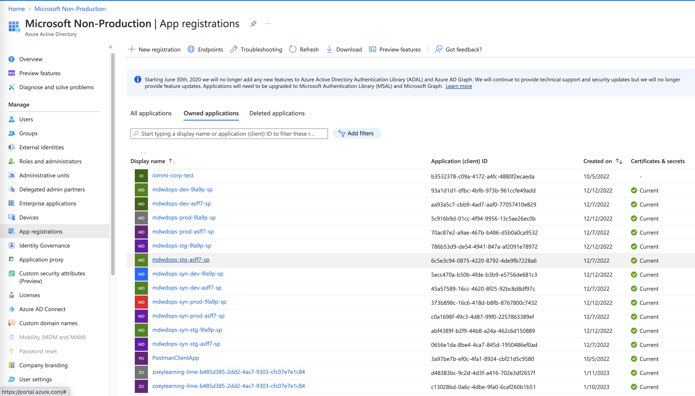
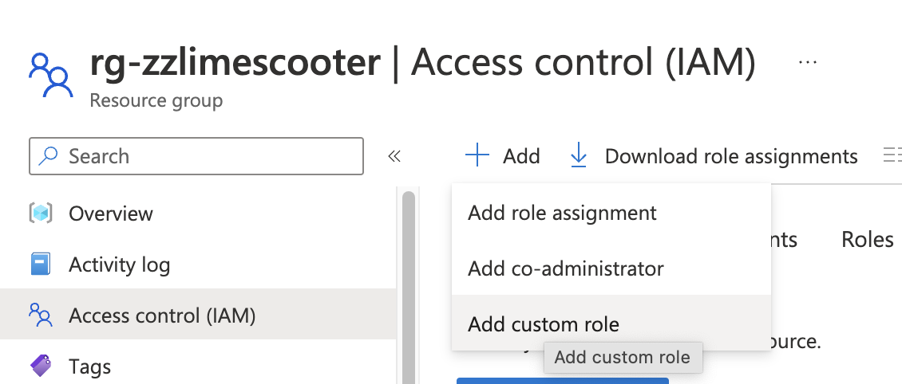

# How to Assign a Custom Role to a Service Principal in Azure DevOps
Azure DevOps provides a seamless integration with Azure Active Directory (AAD) for managing access to Azure resources. In this tutorial, we will explore the steps to assign a custom role to a service principal in Azure DevOps.

## Step 1: Create a Service Connection
To begin with, we need to create a service connection in Azure DevOps by navigating to `Project Settings` -> `Service Connections` -> `New Service Connection`. From the available options, select "Azure Resource Manager" and follow the prompts to create the service connection.

## Step 2: Verify the Service Principal
Once the service connection is created, we can verify the creation of a service principal in the Azure Active Directory. Navigate to `Azure Active Directory` -> `App Registrations` -> `Owned Applications`. You should see a new app with the name of the Azure DevOps project.

## Step 3: Create a Custom Role
Next, we need to create a custom role that grants write permission to Microsoft.Authorization/roleAssignments. This permission is required to allow the pipeline to run a Terraform script with the role assignment segment. Navigate to the resource group where the resources are located: `IAM` -> `Add` -> `Add custom role`. Provide a name and description for the role and add the permission to write role assignments.

## Step 4: Assign the Role to the Service Principal
Now we need to assign the custom role to the service principal created by the service connection. Navigate to the subscription in Azure Portal -> `IAM` -> `Add Role Assignment`. Select the custom role we created earlier and choose the service principal as the member. Enter the name of the service principal, which should match the app name created in Step 2.

And that's it! With these steps, we have successfully assigned a custom role to a service principal in Azure DevOps. By granting appropriate permissions, we can manage access to Azure resources through pipelines and ensure security compliance.
